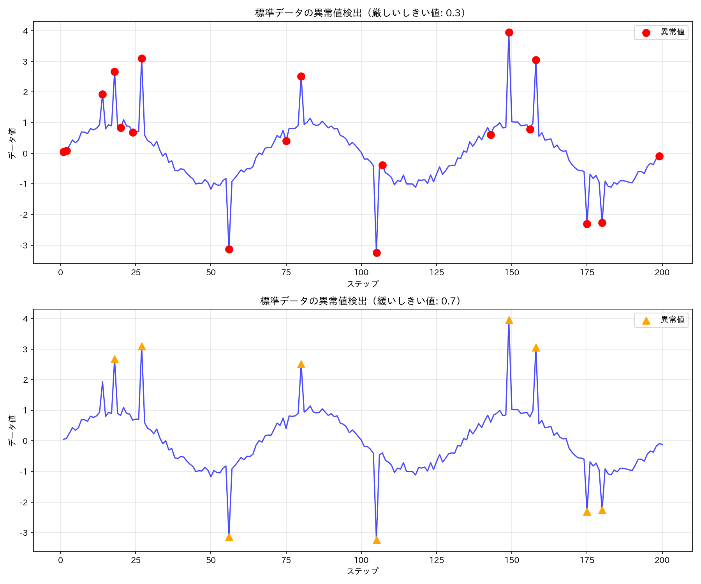

# tascpy 高度なサンプル集

このディレクトリには、tascpy ライブラリの高度な使用例を示すサンプルスクリプトが含まれています。これらのサンプルは基本的な操作を理解した後に取り組むことで、より実践的なデータ分析シナリオにおける tascpy の活用方法を学ぶことができます。

## サンプルファイル一覧

1. **[01_outlier_analysis_visualization.py](./01_outlier_analysis_visualization.py)** - 異常値の検出・除去・可視化
   - 異常値を含む模擬データの生成
   - 移動平均を使った異常値検出
   - 異常値の視覚的強調表示
   - 異なるパラメータによる異常値除去の効果比較
   - エッジ処理方法の比較
   - 前処理後データのトレンド分析
   
   ```python
   # 異常値の検出と可視化のチェーンメソッド例
   result_vis = (
       filtered_collection.ops
       .filter_out_none(columns=["data"])  # NaN値を除去
       .visualize_outliers(
           column="data",
           window_size=15,
           threshold=0.3,  # しきい値
           plot_type="line",
           highlight_color="red",
           outlier_marker="o",
           ax=ax1,
           normal_alpha=0.7
       )
       .end()
   )
   
   # 異常値の除去と効果確認のチェーンメソッド例
   cleaned_result = (
       filtered_collection.ops
       .remove_outliers(
           column="data", 
           window_size=15, 
           threshold=0.5,
           result_column="cleaned_data"
       )
       .end()
   )
   ```

## 可視化結果

このサンプルでは、異常値の分析と除去に関する以下の視覚化結果が `examples/advance/imgs` ディレクトリに保存されます：

1. **outlier_visualization_comparison.png** - 異なるしきい値での異常値検出の比較
2. **outlier_removal_effect.png** - 異常値除去前後のデータの比較
3. **edge_handling_outlier_comparison.png** - 異なるエッジ処理方法の効果比較
4. **cleaned_data_trend.png** - クリーニング後のデータトレンド分析



## 異常値処理の主要機能

tascpy では以下の異常値処理機能が提供されています：

### 1. 異常値の検出と可視化

```python
# 異常値の検出とフラグ付け
flagged_collection = (
    collection.ops
    .detect_outliers(
        column="data", 
        window_size=15, 
        threshold=0.5,
        flag_column="_outlier_flags_data"
    )
    .end()
)

# 検出した異常値の視覚化
collection.ops.visualize_outliers(
    column="data",
    window_size=15,
    threshold=0.5,
    plot_type="line",
    highlight_color="red",
    outlier_marker="o"
).end()
```

### 2. 異常値の除去

```python
# 異常値を除去して新しい列に保存
cleaned_collection = (
    collection.ops
    .remove_outliers(
        column="data", 
        window_size=15, 
        threshold=0.5,
        result_column="cleaned_data",
        edge_handling="mirror"  # エッジ処理方法の指定
    )
    .end()
)
```

### 3. エッジ処理方法


```python
# ミラーリングによるエッジ処理の例
result_mirror = (
    collection.ops
    .remove_outliers(
        column="data", 
        window_size=15,
        threshold=0.5,
        edge_handling="asymmetric",
        result_column="cleaned_mirror"
    )
    .end()
)
```

## 実践的なワークフロー例

異常値処理を含む実践的なデータ分析ワークフロー：

```python
# 実践的な異常値処理ワークフロー
result = (
    collection.ops
    .filter_out_none(columns=["raw_data"])  # 欠損値を除去
    .remove_outliers(
        column="raw_data", 
        window_size=21, 
        threshold=0.7,
        result_column="cleaned_data"
    )  # 異常値除去
    .moving_average(
        column="cleaned_data", 
        window_size=5, 
        result_column="smoothed_data"
    )  # スムージング
    .end()
)

# 可視化による確認
fig, ax = plt.subplots(figsize=(10, 6))
(
    result.ops
    .plot(
        x_column="Step",
        y_column=["raw_data", "cleaned_data", "smoothed_data"],
        plot_type="line",
        color=["gray", "blue", "red"],
        marker=["", "", ""],
        linestyle=[":", "-", "--"],
        linewidth=[1, 1, 2],
        label=["生データ", "クリーニング後", "スムージング後"],
        ax=ax
    )
    .end()
)
```

## パラメータ選択のガイドライン

### 移動ウィンドウサイズの選択

- **小さなウィンドウサイズ** (3-7): 局所的な異常値に敏感、短期的な変動も異常と見なされる可能性
- **中間のウィンドウサイズ** (11-21): 多くの場合の良いバランス
- **大きなウィンドウサイズ** (31以上): 長期的なトレンドからの逸脱を検出、短期的な変動は無視

### しきい値の選択

- **小さなしきい値** (0.1-0.3): 厳格な異常値検出、正常なデータも異常と判定される可能性
- **中間のしきい値** (0.5-0.7): 多くの場合の良いバランス
- **大きなしきい値** (1.0以上): 緩やかな異常値検出、極端な外れ値のみ検出

適切なパラメータはデータの特性や分析の目的によって異なります。複数のパラメータ組み合わせを試し、視覚的に確認することをお勧めします。
